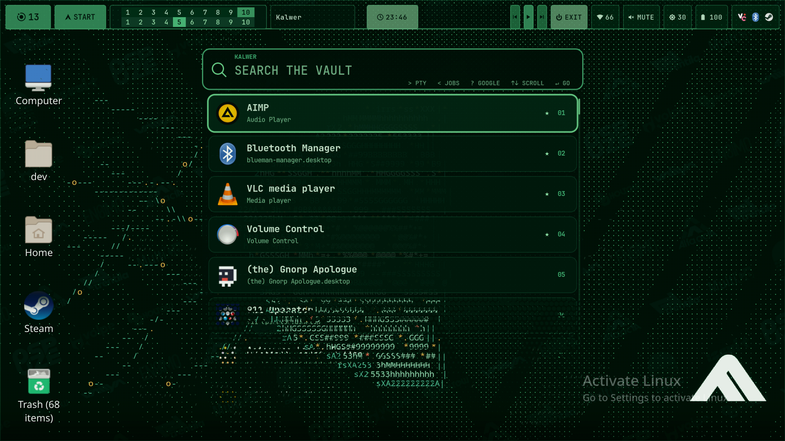
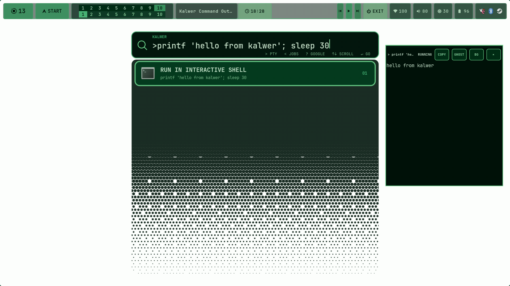
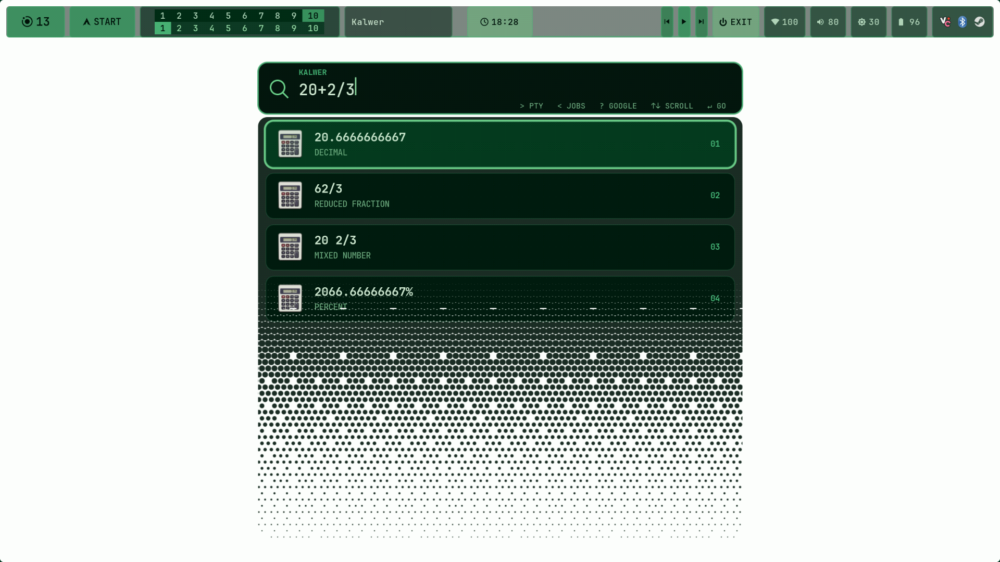

# Kalwer

A resident native GTK3/Cairo frontend for Elephant, visually paired with
Workspace Field. The complete launcher is rendered to an offscreen ARGB
surface first, uploaded only when its content changes, then exposed through a
GPU fragment-shader halftone coverage mask.
The circles in the mask never carry colors of their own: every visible pixel
comes from the finished launcher below it.





## Features

- GPU-backed, animated halftone coverage over the fully rendered interface.
- Scrollable Elephant application search with persistent, unlimited favourites
  grouped above normally ranked results.
- Interactive Zsh command sessions, background jobs, completion notifications,
  output copying, and live handoff to Ghostty.
- Firefox Google search mode and a native precedence-aware calculator.
- Warm resident process with three-second query and selection restoration.
- Background GitHub release updates on both Linux and Windows.

## Build and run

```sh
make
./elephant-field
./elephant-field --daemon
```

The resident process owns `pl.aridlin.ElephantField`; activating that
application ID toggles the window without constructing a new GTK process.

## Controls

- Type to search Elephant's `desktopapplications` provider.
- Up/Down or Ctrl+P/Ctrl+N moves the selection.
- Left/Right, Home/End, Shift-selection, and Ctrl+A/C/X/V edit the search text.
- Enter launches the selected result.
- Shift+Enter persistently favourites or unfavourites an Elephant result and
  immediately moves the pinned group to the top.
- Escape closes the launcher.
- Mouse hover and click work on result rows.
- Five on-screen rows are interactive. Mouse wheel, arrows, and Page Up/Down
  scroll later results into those selectable positions; the lower rows are a
  non-interactive halftone preview.
- `> command` runs immediately in an interactive VTE popup. Tab and Shift+Tab
  cycle Zsh-resolved command/path completions.
- Command popups can copy output, continue the same tmux session in Ghostty, or
  detach into the background. The matching shortcuts are Ctrl+Shift+C/G/B.
- `<` lists running background commands; selecting one reattaches its live popup.
- Background completion sends a success or failure desktop notification based
  on the process exit code.
- `? search` opens Google in Firefox after switching to the most recently used
  Firefox workspace.
- Arithmetic is evaluated locally with normal precedence, parentheses, powers,
  percent-of, `sqrt(...)`, and `√`. Decimal is the first result, followed by
  reduced fraction, mixed-number, and percentage forms when applicable.
- Reopening Kalwer within three seconds restores the exact query, result
  selection, and scroll position.
- `/settings` opens persistent controls for prompt retention, the PTY connector
  and vertical-expansion durations, and the finished-command auto-close delay.
- `/exit` closes the resident Kalwer process cleanly.



GTK/Cairo remains responsible for font shaping, themed icons, and the finished
UI texture. `GtkGLArea` handles the per-frame ordered dot-density field,
radius falloff, selection outline, alpha compositing, and opening reveal.

The backend request is run asynchronously as
`elephant query --json --async=false`, and activation is delegated back to
Elephant with the result's provider, identifier, and first/default action.

## Installation

The [latest GitHub release](https://github.com/aridlin/kalwer/releases/latest)
includes both `kalwer-linux-x86_64` and `kalwer.exe`. The Linux build is the
normal optimized, unstripped executable and uses the GTK3/VTE runtime libraries
listed below.

On Arch Linux, install `kalwer` from the AUR. For a source build, install a C++20
compiler plus GTK3, JSON-GLib, libepoxy, VTE3, pkgconf, and make, then run:

```sh
make
sudo make PREFIX=/usr install
sudo install -Dm644 kalwer.service /usr/lib/systemd/user/kalwer.service
systemctl --user enable --now kalwer.service
```

The standalone Linux build uses `curl` as its background HTTPS update transport;
package-managed installs in non-writable system directories are left to their
package manager. Optional runtime integrations are Elephant, tmux, libnotify,
Firefox, Ghostty, and Hyprland. A typical resident activation binding is:

```ini
bindd = $mainMod, E, App launcher, exec, /usr/bin/gdbus call --session --dest pl.aridlin.ElephantField --object-path /pl/aridlin/ElephantField --method org.gtk.Application.Activate '{}'
windowrule = border_size 0, match:class elephant-field
windowrule = no_shadow on, match:class elephant-field
```

Kalwer is released under the MIT License.

## Windows prototype

The native Windows target lives in `windows/`. It uses Win32 for its resident
single-instance process and global `Alt+Space` binding, Direct2D/DirectWrite to
render the complete launcher, and Direct3D 11 plus DirectComposition to apply
the same GPU halftone coverage mask to that finished interface.

Cross-compile it from Linux with MinGW-w64:

```sh
cmake -S windows -B build-windows -G Ninja \
  -DCMAKE_SYSTEM_NAME=Windows \
  -DCMAKE_CXX_COMPILER=x86_64-w64-mingw32-g++ \
  -DCMAKE_BUILD_TYPE=Release
cmake --build build-windows
```

Run `kalwer.exe` once to keep it resident. `Alt+Space` toggles it; a
second invocation also toggles the existing instance. This early port already
supports Start Menu application discovery, fuzzy search, native edit/selection
keys and clipboard shortcuts, scrolling, persistent Shift+Enter favourites,
multi-form calculator queries, and `?` Google queries. `>` runs commands
directly in an embedded interactive ConPTY session: output streams into the
animated side panel, keyboard input is forwarded to the process, output can be
selected/copied, and completed commands retain their real exit code. `BG`
detaches a live command; `<` lists background commands and reopens their panel,
with a success/failure notification on completion. `/settings` adds the shared
timing/retention controls plus a current-user autostart toggle; it writes only
the `HKCU\\Software\\Microsoft\\Windows\\CurrentVersion\\Run` `Kalwer` value and
never requires administrator access. `/exit` terminates the resident instance.
Update checks run off the input/render thread. A newer `kalwer.exe` is staged
beside the running executable and atomically applied the next time the resident
process starts. Both platform updaters require the matching release SHA-256 file
and validate the executable format before installation; a failed or incomplete
download leaves the current build intact.
